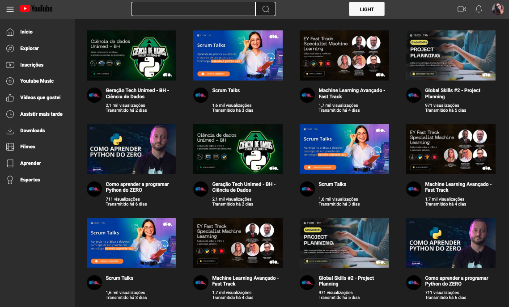

## Desafio: Reproduzindo a Listagem do YouTube com Grid Layout no CSS
- Desafio proposto pela especialista Michele Ambrosio como parte da formação de CSS da Dio.
- Desafio respondido por Alisson Rangel.

## Acréscimos
- Criei um botão para alternar entre modos dark e light;
- Criei o modo dark via javascript e CSS;
- Ao clicar no modo dark eu alterei as cores dos ícones para ficarem brancos através de javascript;
- Alterei os textos também para ficarem claros no modo dark.

## Light

## Dark
